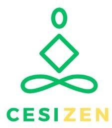

# CESIZen - Application de Santé Mentale



CESIZen est une application web moderne dédiée à l'évaluation et à la gestion du stress basée sur l'échelle de Holmes et Rahe. L'application permet aux utilisateurs de réaliser des diagnostics de stress personnalisés et de recevoir des recommandations adaptées à leur niveau de stress.

## 🌟 Fonctionnalités Principales

- **Évaluation du stress** : Questionnaires basés sur l'échelle scientifique de Holmes et Rahe
- **Diagnostics personnalisés** : Analyse du niveau de stress avec recommandations adaptées
- **Historique des diagnostics** : Suivi de l'évolution du stress dans le temps
- **Interface admin** : Gestion complète des questionnaires, niveaux de stress et recommandations
- **Authentification sécurisée** : Système JWT avec gestion des rôles
- **Design responsive** : Interface adaptée mobile et desktop
- **Gestion de contenu** : Système CMS intégré pour la personnalisation

## 🏗️ Architecture Technique

### Backend (Laravel)
- **Framework** : Laravel 12 avec PHP 8.2
- **Base de données** : MySQL 8.0 / SQLite (développement)
- **Authentification** : JWT (tymon/jwt-auth)
- **Cache** : Redis
- **API** : RESTful API avec validation complète

### Frontend (Vue.js)
- **Framework** : Vue 3 avec TypeScript
- **State Management** : Pinia
- **Routing** : Vue Router 4
- **Build Tool** : Vite
- **Mobile** : Support Capacitor pour apps natives

### DevOps
- **Conteneurisation** : Docker & Docker Compose
- **CI/CD** : GitHub Actions
- **Reverse Proxy** : Nginx
- **SSL** : Let's Encrypt (production)
- **Monitoring** : Watchtower pour mises à jour automatiques

## 📁 Structure du Projet

```
cesizen/
├── backend/                 # API Laravel
│   ├── app/                # Code application
│   ├── database/           # Migrations & seeders
│   ├── docker/             # Configuration Docker
│   └── routes/             # Routes API
├── frontend/               # Application Vue.js
│   ├── src/                # Code source
│   ├── docker/             # Configuration Docker
│   └── public/             # Assets statiques
├── docker-compose.*.yml    # Configurations environnements
└── docs/                   # Documentation (ce dossier)
```

## 🚀 Installation Rapide

### Prérequis
- Docker & Docker Compose
- Git

### Développement Local

```bash
# Cloner le repository
git clone https://github.com/votre-username/cesizen.git
cd cesizen

# Lancer l'environnement de développement
docker-compose -f docker-compose.dev.yml up -d

# L'application sera accessible sur :
# Frontend: http://localhost:8080
# Backend API: http://localhost:8000
# MailHog: http://localhost:8025
```

### Configuration Initiale

1. **Variables d'environnement** :
   ```bash
   # Copier les fichiers d'exemple
   cp backend/.env.example backend/.env
   
   # Générer les clés
   docker-compose exec backend php artisan key:generate
   docker-compose exec backend php artisan jwt:secret
   ```

2. **Base de données** :
   ```bash
   # Exécuter les migrations et seeders
   docker-compose exec backend php artisan migrate --seed
   ```

3. **Comptes par défaut** :
   - Admin : `admin@cesizen.com` / `password123`
   - Utilisateur : `user@cesizen.com` / `password123`

## 📖 Documentation Détaillée

- [**Backend README**](./backend/README.md) - Configuration Laravel, API, base de données
- [**Frontend README**](./frontend/README.md) - Application Vue.js, composants, stores
- [**Guide de Déploiement**](./DEPLOYMENT.md) - Production, staging, CI/CD

## 🔧 Environnements

### Développement
- URL: http://localhost
- Base de données: MySQL (avec MailHog pour emails)
- Mises à jour automatiques: Activées (5min)

### Test
- URL: http://cesizen-test.chickenkiller.com
- Tests automatisés avec Cypress
- Mises à jour automatiques: Activées (2min)

### Production
- URL: https://cesizen-prod.chickenkiller.com
- SSL automatique avec Let's Encrypt
- Monitoring et sauvegardes automatiques

## 🧪 Tests

```bash
# Tests backend (PHPUnit)
docker-compose exec backend php artisan test

# Tests frontend (à configurer)
cd frontend && npm run test

# Tests E2E (Cypress)
docker-compose --profile testing up cypress
```

## 📊 API Documentation

L'API suit les conventions RESTful. Endpoints principaux :

- `POST /api/login` - Authentification
- `GET /api/questionnaires` - Liste des questionnaires
- `POST /api/diagnostics` - Créer un diagnostic
- `GET /api/diagnostics` - Historique utilisateur
- `GET /api/admin/*` - Routes administrateur

Documentation complète dans [Backend README](./backend/README.md).

## 🔐 Sécurité

- Authentification JWT avec refresh tokens
- Validation côté serveur et client
- Protection CSRF
- Chiffrement des mots de passe (bcrypt)
- Headers de sécurité (HTTPS, HSTS, etc.)
- Validation des entrées utilisateur

## 🤝 Contribution

1. Fork le projet
2. Créer une branche feature (`git checkout -b feature/AmazingFeature`)
3. Commit les changements (`git commit -m 'Add some AmazingFeature'`)
4. Push vers la branche (`git push origin feature/AmazingFeature`)
5. Ouvrir une Pull Request

### Standards de Code
- PSR-12 pour PHP
- ESLint/Prettier pour TypeScript/Vue
- Tests requis pour nouvelles fonctionnalités
- Documentation mise à jour

## 📝 Changelog

Voir [CHANGELOG.md](./CHANGELOG.md) pour les détails des versions.

## 📄 Licence

Ce projet est sous licence MIT. Voir [LICENSE](./LICENSE) pour plus de détails.

## 👥 Équipe

- **Développement** : Équipe CESI
- **Design UX/UI** : Équipe CESI
- **DevOps** : Équipe CESI

## 🆘 Support

- **Issues** : [GitHub Issues](https://github.com/votre-username/cesizen/issues)
- **Documentation** : [Wiki du projet](https://github.com/votre-username/cesizen/wiki)
- **Email** : support@cesizen.com

## 🎯 Roadmap

- [ ] Application mobile native (iOS/Android)
- [ ] Notifications push personnalisées
- [ ] Intégration objets connectés (montres)
- [ ] IA pour recommandations avancées
- [ ] Tableau de bord analytique
- [ ] API publique pour intégrations tierces

---

*CESIZen - Prendre soin de sa santé mentale, une évaluation à la fois.* 💚